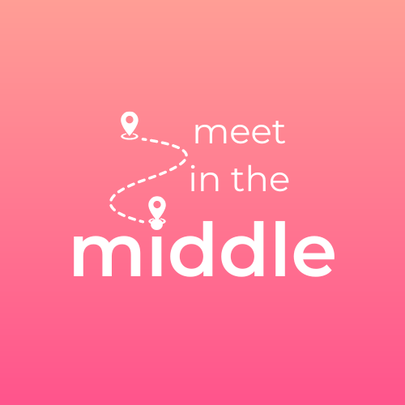

Meet in the Middle is a Full Stack app that facilitates the meeting destination of its users.

Building several features such as:

- Geocoding and Nearby Search features which take two user inputs and display the midpoint / Points of Interest using location APIs.
- Scrollable cards that contain location information, ratings, reviews and photos from the Yelp Fusion API.
- User ‘Favourites’ using Firebase collections, location sharing and calendar events.
- Pressable map markers that scroll the NearbyList to the selected place (using the ScrollToIndex prop).
- Routing for walking, driving or public transport along with detailed directions.
